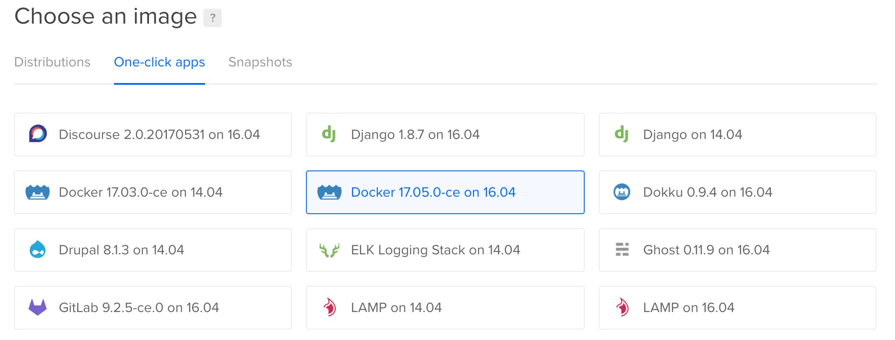

## Creating and seeding a torrent on a VPS


Create your virtual private server. I'm using an Ubuntu 16.04 server from Digital Ocean with with Docker 17.05.0-ce pre-installed.

> 


`ssh` into your new server.

```
ssh root@your.ip.address.here
```

Open ports 9091 and 51413 in your firewall and make sure `unzip` is installed.

```
ufw allow 9091
ufw allow 51413
apt-get -y install unzip
```

Now download the Docker container we'll be using. This is my fork of [dperson's container](https://github.com/dperson/transmission) for the open-source bittorrent client [Transmission](https://transmissionbt.com), which includes a command-line tool for creating new torrents.  

```
docker pull stevemclaugh/transmission
```

When it finishes downloading, enter the following command to run the container in detached mode. This will create several new directories on your VPS under `/home/transmission-daemon`.

```
docker run --name transmission -it -d -p 51413:51413 -p 51413:51413/udp -p 9091:9091 -v /home/transmission-daemon:/var/lib/transmission-daemon stevemclaugh/transmission
```

`cd` into Transmission's `Downloads` directory.

```
cd /home/transmission-daemon/Downloads
```

Download and unzip our data bundle.

```
wget http://www.stephenmclaughlin.net/DataRefuge/DataRefuge_001_test.zip

unzip DataRefuge_001_test.zip
```


<!--
How to create the checksum and zip files we're using:

```
find DataRefuge_001_test/* -type f -exec md5sum {} \;  > DataRefuge_001_test/_checksums.md5

zip -r DataRefuge_001_test.zip DataRefuge_001_test/
```
-->


Use the included checksum list to make sure everything arrived intact. This may take a few minutes.

```
md5sum -c DataRefuge_001_test/_checksums.md5
```

If every file passes the check, we're ready to create our torrent file. Enter the following command to launch a terminal session in our running Docker container.


```
docker exec -ti transmission /bin/bash
```

Now `cd` to the `Downloads` directory.

```
cd /var/lib/transmission-daemon/Downloads
```


```
transmission-create -n DataRefuge_001_test/ \
--tracker udp://tracker.opentrackr.org:1337 \
--tracker http://tracker2.wasabii.com.tw:6969/announce \
-o ../info/torrents/DataRefuge_001_test.torrent
```


#```
#chmod 775 DataRefuge_001_test/
#chmod 775 DataRefuge_001_test/*
#```


control+p+q to leave Docker.

Relaunch the transmission container to begin seeding:

```
docker rm -f transmission
docker run --name transmission -it -d -p 51413:51413 -p 51413:51413/udp -p 9091:9091 -v /home/transmission-daemon:/var/lib/transmission-daemon stevemclaugh/transmission
```


`your.ip.address.here:9091`

The default username and password are 'admin' and 'admin'.


Right click > "Verify Local Data"
